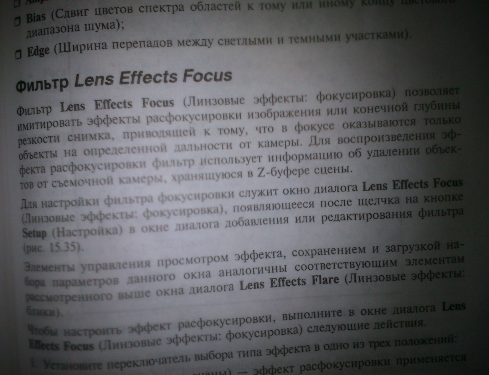
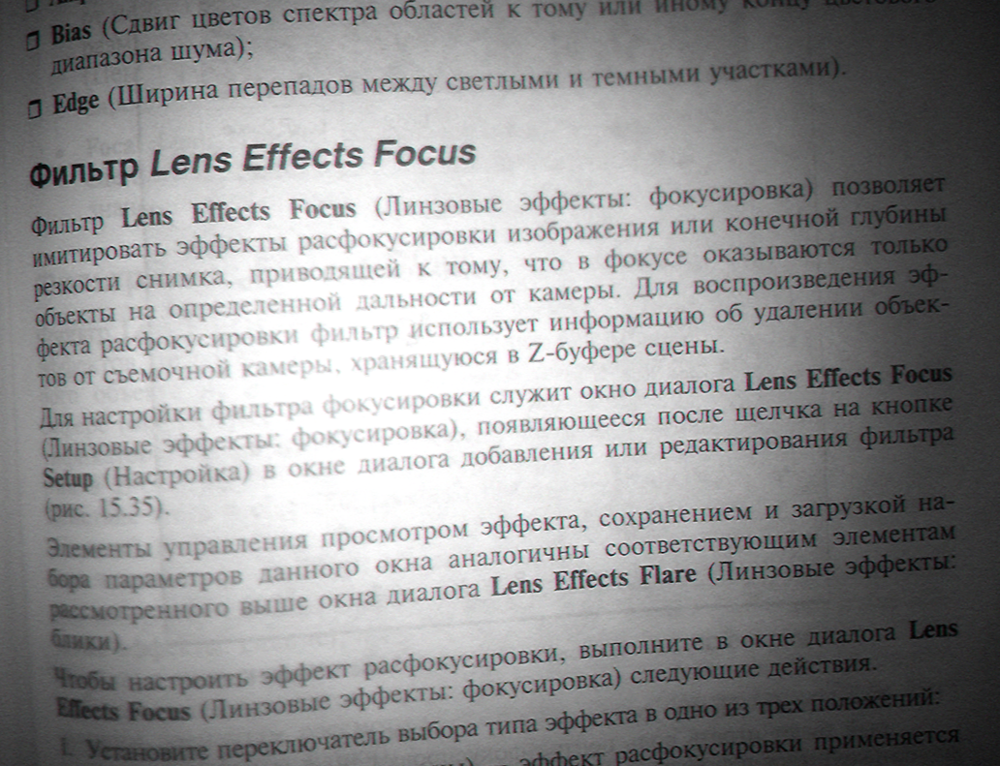
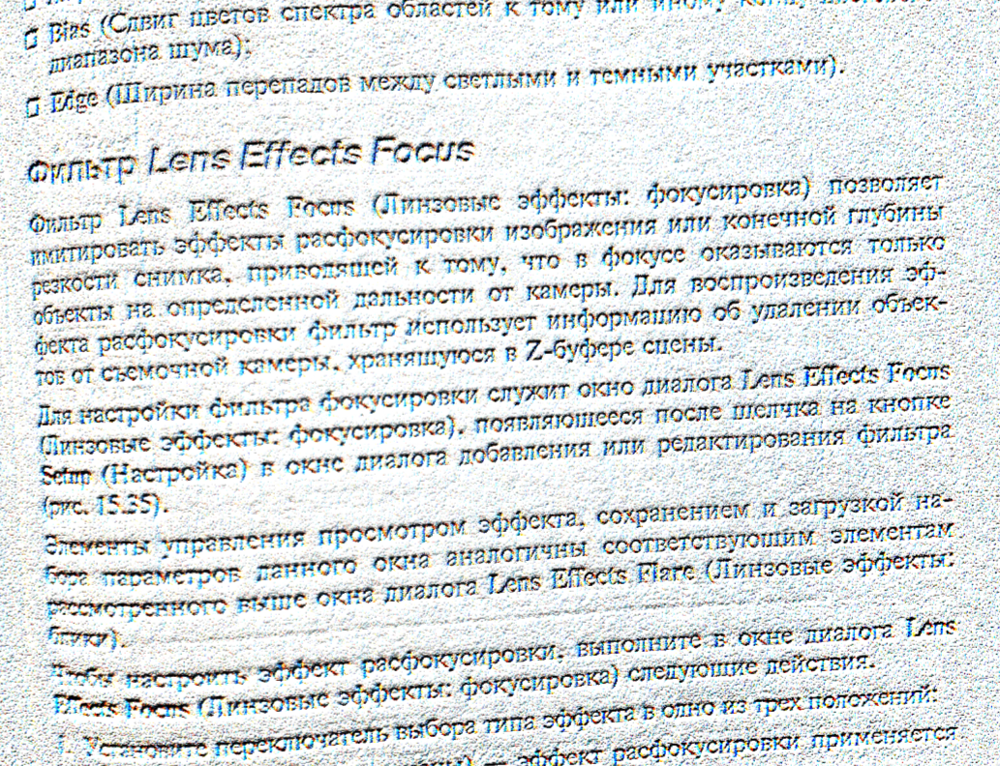

# Efficient Image Filter Using OpenMP

This is a project made to implement image filtering and enhancing algorithm in a highly efficient manner. The main idea is to utilize the advancement in hardware parallelism by utilizing multiple threads in a parallel program and vectorization.

By **Kenny Gozali** and **Walter Ehrenberger**, as a submission for the course algorithm engineering by Mark Blacher.

## Setup

1. ``` $ cmake . ```
2. ``` $ make ```
3. ``` $ ./main -f "file_name" ```
    
Given files must be stored in ```/static``` and the processed file will be placed in ```/static``` as well.

## Options

1. ```./main``` (with the following options)
2. ```-f --file_name=file_name```, file must be places in `/static` first.
3. ```-n --num_threads=n```
4. ```-e --extremeMode```
5. ```-h --help```

## What it does

It basically enhances bad photographs to make text more readable. There is also an extreme mode to work with images that are too dark.


<br>

<br>


## Requirements

* gpp compiler with version > 9.6 
* cmake
